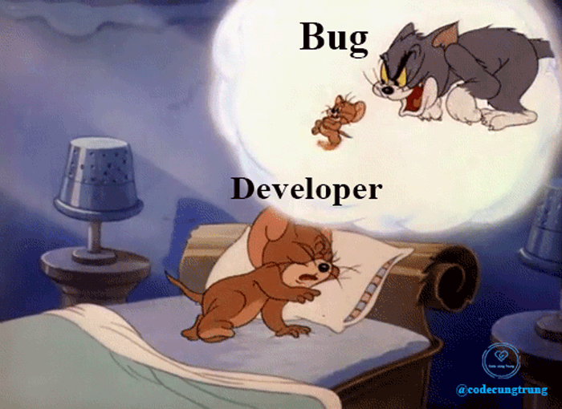

<h1 align="center">👋👋 Xin Chào 👋👋</h1>

###

  

###

Hello, Thanh here, I'm a software engineer from Ha Long. I am a person who loves technology and loves to express myself, to experience, to learn new things around me. People know me as a kind, sociable, easy-going guy and especially I love to cook.
I thought you are the best in this world!!!

###

<h2 align="center">Tech Stack 😎</h2>

###

  
  
  
  
  
  
  
  
  
  
  
  
  
  
  

###

<h2 align="center">My Github Stats 🤓</h2>

###

  
  

###

###

<h2 align="center">🙂Contact Me!!🙂</h2>

  
  
  
  
  

###

  

###
